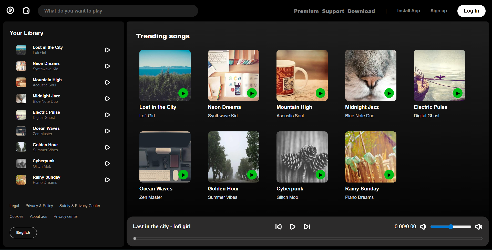
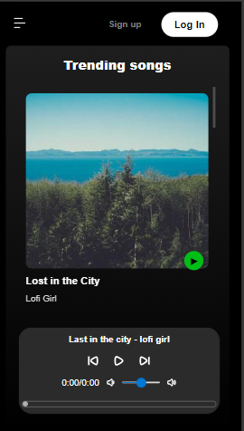

# 🎵 Spotify Clone - Web Player

A fully responsive Spotify clone built with Vanilla JavaScript, CSS Grid, and HTML5 Audio. This project features dynamic song rendering, a custom-built music player, and a mobile-friendly navigation system.
---

## 📸 Screenshots

| Desktop View | Mobile Sidebar |
| :--- | :--- |
|  |  |

---

## 🚀 [Live Demo](https://codamee.github.io/spotify-clone/)

---

## ✨ Features

* **Custom Audio Engine:** Managed via the HTML5 `Audio()` API for seamless play, pause, and track switching.
* **Dynamic UI Rendering:** Songs are generated dynamically from a `songs.js` data module—no hardcoded HTML cards.
* **Seek Bar:** Custom progress bar that allows users to click and "seek" to any part of the song.
* **Volume Management:** * Interactive range slider.
* **Responsive Design:**
    * **Desktop:** Professional Sidebar + Main Content Grid.
    * **Mobile/Tablet:** Sidebar transforms into a smooth, slide-out drawer using JavaScript transitions.
    * **Auto-scaling Cards:** Uses `grid-template-columns: repeat(auto-fill, minmax(...))` to ensure cards look perfect on any screen size.

---

## 🛠️ Built With

* **HTML5:** Semantic layout and Audio integration.
* **CSS3:** Flexbox, CSS Grid, and `backdrop-filter` for glassmorphism effects.
* **JavaScript (ES6+):** * **Modules:** For clean, organized code.
    * **Logic:** Array methods (`find`, `findIndex`) to manage playlist flow.
    * **DOM API:** Real-time updates for time, progress, and UI states.

---

## 🔧 Installation & Setup

1. **Clone the repository:**
   ```bash
   git clone [https://github.com/codamee/spotify-clone.git](https://github.com/codamee/spotify-clone.git)
